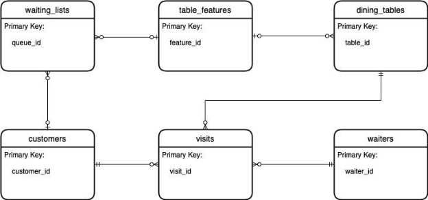
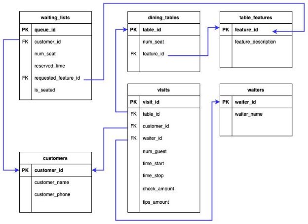

Course:  CS 340 - Fall 2021 

Assignment:   Project Step 7 (Portfolio Assignment) Group:   49 

Team members:  Chi Hang Leung, Tobi Fanibi Team’s name:   DROP TABLE mic; 

Project Title:   Restaurant Table Manager 

**Project Outline:** 

In the US, customers experienced a wait in nearly 93% of restaurants (FSR magazine, 2013). The average restaurant wait time is about 23 minutes per party and nearly a third of them have wait time of more than 30 minutes (FSR magazine, 2013). To provide an efficient solution to ease the wait time problem, the webapp we are creating will be a management system designed for restaurant managers or hostesses to manage a restaurant’s tables, waiters, and customers. The database will store pertinent information about the tables with their features, waiters, customers, and waiting lists. This website will allow managers or hostesses to manage a waiting list of customers and find the tables that fit customers’ needs the most. It also keeps track of each visit by recording details such as the information about the table/waiter/customer, time spent, and check/tips amount. 

Citation: 

FSR magazine. (2013, October 8). *Study released on Average Restaurant Wait Times*. 

Retrieved October 7, 2021, from https://www.fsrmagazine.com/content/study-released- average-restaurant-wait-times.  

**Database Outline**

*dining\_tables*: Representing actual tables in a restaurant. 

table\_id: int, auto\_increment, unique, not null, primary key (Table’s ID) num\_seat: int, not null (Number of customers that the table can be seated) feature\_id: int, default null, foreign key (represents the feature a dining table has) 

Relationships: 

- 1:M relationship with *visits* using table\_id as the foreign key in *visits*. A dining table does not have to be used in a visit but can be used repeatedly in many visits (at different times). 
- M:1 relationship with *table\_features* using feature\_id as the foreign in dining\_tables. A feature of the table does not have to be in any dining tables but can appear in many of them. 
- M:M relationship with waiters, using *visits* as composite entities. A dining table can have different waiters while servicing customers at different times. A waiter can also serve customers at multiple dining tables at the same or different times. 
- M:M relationship with customers, using *visits* as composite entities. A customer can be served by the same waiter at different times and a waiter can serve many different customers at the same or different times. 

*waiters*: Represents working waiters in a restaurant. 

waiter\_id: int, auto\_increment, unique, not null, primary key (Waiter’s ID) waiter\_name: varchar(255), not null (Full name of the waiter) 

Relationships: 

- 1:M relationship with *visits* using waiter\_id as the foreign key in *visits*. A waiter does not have to serve in every visit but can participate in many visits. 
- M:M relationship with dining\_tables, using *visits* as composite entities. A waiter can serve at many dining tables and a dining table can have many waiters while visited by customers at different times. 
- M:M relationship with customers, using visits as composite entities. A waiter may serve the same customer many times during different visits and a customer can also be served by many waiters during different visits. 

*customers*: Representing the customer (per table) who makes a reservation or requests a table. 

customer\_id: int, not null, primary key (Customer’s ID) 

customer\_name: varchar(255), not null (Full name or preferred name of the customer) customer\_phone: varchar(255) (Phone number of the customer, if they don’t mind leaving a number. Can be null) 

Relationships: 

- 1:M relationship with *waiting\_lists* using customer\_id as the foreign key in *waiting\_lists*. A customer can make zero to many reservations at different times. On the other hand, each reservation corresponds to at most one customer. Setting Null to customer\_id in the waiting\_lists will remove the relationship and indicate that the reservation has been cancelled. 
- 1:M relationship with *visits* using customer\_id as the foreign key in *visits*. A customer can visit the restaurant many times and have many visits but they can also be new customers with reservations and have not been served yet. 
- M:M relationship with waiters, using *visits* as composite entities. A customer can be served many times by the same waiter and the same waiter can serve many different customers. 
- M:M relationship with dining\_tables, using *visits* as composite entities. A customer can be seated at the same table at different times and a table can be seated by many different customers at different times. 

*waiting\_lists*: A waiting list for the tables. Reservations and walk-in requests are treated the same. 

queue\_id: int, not null, primary key (ID for the queue) 

customer\_id: int, foreign key (Customer’s ID) 

num\_seat: int, not null (Number of seats that the reservation is for) 

reserved\_time: datetime, not null (Date and time the customer want to dine) requested\_feature\_id: int, default null, foreign key (represent what kind of table the customer want) 

is\_seated: tinyint, not null (Whether (1) or not (0) the customer has been seated) 

Relationships: 

- M:1 relationship with *table\_features* as many customers on the waitlist may request the same kind of table but only one feature of a table can be requested for each reservation. 
- M:1 relationship with *customers* using customer\_id as the foreign key in *waiting\_lists*. Each item on the waiting\_lists corresponds to at most one customer. If an item does not correspond to any customer with Null as the customer\_id, then it means the reservation has been cancelled. However, a customer can make many reservations at different times. 

*table\_features*: A list of possible features that a dining table can have. Customers can request a specific type of table while making reservations. 

feature\_id: int, not nul, primary key (ID for the feature of a dining table) feature\_description: varchar(255) not null (the description of the special feature of a dining table) 

Relationships: 

- 1:M relationship with dining\_tables as many different tables may have the same special feature but each dining table may only have one feature. 
- 1:M relationship with waiting\_lists as many different reservations may request for the same type of table but each reservation can only have one request at the most. 

*visits*: Represent each visit by the customer with his/her guests at a single table. 

visit\_id: int, auto\_increment, unique, not null, primary key (ID for each visit) table\_id: int, not null, foreign key (Table’s ID) 

customer\_id: int, not null, foreign key (Customer’s ID) 

waiter\_id: int, not null, foreign key (Waiter’s ID) 

num\_guest: int, not null (Number of guests within a single visit) 

time\_start: datetime, not null (Date and Time of seating at the table) 

time\_stop: datetime, not null (Date and Time of leaving the table) 

check\_amount: decimal(5, 2), not null (Dollar amount of the check not including tips) tips\_amount: decimal(5, 2), not null (Dollar amount of the tips for the wait staff) 

Relationships: 

- M:1 relationship with *customers* using customer\_id as the foreign key in *visits*. Each visit is attributed to exactly one customer only but the same customer can have multiple visits at different times. 
- M:1 relationship with *dining\_tables* using table\_id as the foreign key in *visits*. Each visit is attributed to exactly one dining table only but the same dining table can be used in multiple visits at different times. 
- M:1 relationship with *waiters* using waiter\_id as the foreign key in *visits*. Each visit is attributed to exactly one waiter only but a waiter can participate in multiple visits. 

**Relationships Summary** 

1:M  customers : waiting\_lists 

customers : visits dining\_tables : visits 

waiters : visits table\_features: waiting\_lists table\_features: dining\_tables 

M:M  customers : waiters 

customers : dining\_tables 

waiters : dining\_tables 

Note: All M:M relationships are using *visits* as the composite entity. 

**Entity Relationship Diagram** 

**Schema:** 

**Screen Captures** 

CREATE / READ / UPDATE / DELETE capable Dining Tables Page

CREATE / READ / UPDATE / DELETE capable Customers Page 

CREATE / READ / DELETE capable Waitlist Page 

CREATE / READ / UPDATE / DELETE capable Waiter Page 

CREATE / READ / DELETE capable Visits Page 

